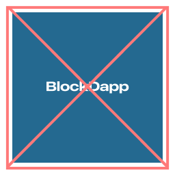

<style>
td, th {
   border: none!important;
}
</style>

[valora-dapp-list.json]: https://github.com/valora-inc/dapp-list/blob/main/src/valora-dapp-list.json
[base.json]: https://github.com/valora-inc/dapp-list/blob/main/locales/base.json

# Adding new dapps

There are some fields that need to be translated into different languages, and this is done by Valora, so to add a new Dapp or category you need to follow the following steps:

- Open [valora-dapp-list.json]. You will see that it has two root objects (both arrays), `categories` and `applications`. The fields for each are described below.
- The process to add a new category or Dapp is analogous, we'll use adding a new Dapp as example. For Dapps, we need to add a new item to the `applications` array. Valora Inc will do translations, so you don't put an actual description there.
- To write the description, open the file [base.json]. This json also has two root objects, `categories` and `dapps`. In our previous example, we'd add under `dapps` a new field called `ubeswap` and write the description there.
- After doing this you should open a PR and ask someone on the Valora team to review it so it can be merged. Once it's merged, the Valora Inc translations team will receive the new strings and translate them into all the supported languages.
- Once they do, Crowdin will automatically open a PR with all the translations. After the Valora team merges this Crowdin PR the new categories or Dapp will be visible in the Valora Wallet.

## Dapps

| Property          | Description                                                                                                                                                                                                                                               |
| ----------------- | --------------------------------------------------------------------------------------------------------------------------------------------------------------------------------------------------------------------------------------------------------- |
| `name`            | The name of the Dapp.                                                                                                                                                                                                                                     |
| `id`              | A unique identifier for the Dapp. The current pattern is to use a lower-kebab-case string.                                                                                                                                                                |
| `categoryId`      | The category id under which the Dapp should show up. This will be deprecated soon, it will be replaced by `categories`.                                                                                                                                   |
| `categories`      | An array of category ids under which the Dapp should show up.                                                                                                                                                                                             |
| `url`             | The URL to open when the Dapp is selected. Can also be a deep link to open in-app.                                                                                                                                                                        |
| `canPurchaseNfts` | Whether the Dapp supports purchasing NFTs. Per [App Store guidelines](https://developer.apple.com/app-store/review/guidelines/#in-app-purchase), dapps allowing to purchase NFTs won't be visible on iOS as it would require payment via in-app purchase. |

## Dapp Logo


Valora will use the logo or symbol you provided for your dapp at a variety of sizes throughout our app. The logo of the Dapp must be added to the `assets` folder. It will be available after merging in a URL with this format: `https://raw.githubusercontent.com/valora-inc/dapp-list/main/assets/{id}.png`. The English description of the Dapp should be added to [base.json] under the path `dapps.{id}`.

<em>\*The symbol will scale to various sizes in the app and should be legible no matter the size displayed</em>

<br>

### ✅ Logo Do’s

1. Size the symbol to 256 x 256 px.
2. No built-in padding.
3. Provide the symbol as a PNG file.
4. The symbol should be in the shape of a circle. If your symbol is not a circle by default, adjust the corner radius to make it fully rounded.


<em>\*Example of a symbol at the correct size, shape, and without padding</em>

<br>

### 🚫 Logo Don'ts

1. Exclude or limit text in your symbol or logo to ensure legibility when displayed at a small size.
2. DO NOT provide your symbol or logo as a vector file (svg, ai, eps).
3. DO NOT provide your symbol or logo as a jpg, PDF, or any other image file other than a PNG.
4. DO NOT size your symbol or logo as a square or squircle. It must be fully rounded to display correctly in Valora.

|  |  |       |
| :------------------------------------------------: | :--------------------------------------------------: | :---------------------------------------------------------: |
|   <em>\*DO NOT include text in your symbol</em>    |      <em>\*DO NOT provide a square symbol</em>       | <em>\*DO NOT provide a squircle or soft-rounded symbol</em> |

<br>

## Dapp Description

<ul>
  <li>Try to avoid overly technical language unless you are confident users with a basic crypto vocabulary will understand or if oversimplification would cause unnecessary confusion. When using common crypto terms, it is still helpful to consider readability for users who speak different languages or are at varying education levels.</li>
 <ul>
      <li>For example, it may be best to avoid terms such as: API, compound interest, yield farming, CICO, if there are simpler ways to describe each function.</li>
      <li>✅ Correct: “Lend, borrow, or pool your crypto while getting rewards</li>
      <li>🚫 Incorrect: “Lend, borrow, or add to a pool while earning compound interest”</li>
      <ul>
      <li><em>Includes terms that some users may not understand</em></li>
    </ul>
        </ul>
        <br>
  </li>
  <li>Start the description with a verb and one or two clear actions for the user that highlight clear ways to use and explore dapp features.</li>
<ul>
      <li>Look for any opportunity to eliminate extraneous descriptive terms and simplify the language.</li>
      <li>✅ Correct: “Exchange, pool, or farm your crypto”</li>
      <li>🚫 Incorrect: “___is a decentralized exchange and automated market maker protocol” </li>
<ul>
      <li><em>Incorrect format, unclear what actions are directed at the user, overly technical language.</em></li>
</ul></ul></ul>
<ul>
  <li>Disclude punctuation at the end of the sentence while adhering to American English spelling and grammatical guidelines.</li>
  <li>Terms <strong>“earn”</strong> and <strong>“reward”</strong> can not be used in combination, and any explicit promise or guarantee of earning funds should be avoided. Instead, opt for general terms like <strong>“rewards”</strong> without specifying what kind of prize or monetary gain a user should expect to receive.</li>
<ul>
      <li>Look for any opportunity to eliminate extraneous descriptive terms and simplify the language.</li>
      <li>✅ Correct: “Enter savings pools to get rewards”</li>
      <li>🚫 Incorrect: “Enter savings pools, and you’ll earn 50 cUSD in rewards”</li>
      <ul>
      <li><em>Uses earn and rewards together and specifies monetary value.</em></li>
</ul></ul></ul>
<br>

## Templating

Valora has basic support for replacing the following template
parameters in a Dapps URL:

| Parameter     | Description            |
| ------------- | ---------------------- |
| `{{address}}` | Valora Account Address |

For example:

```
https://celotracker.com/?address={{address}}
```

## Categories

| Property          | Description                                                                                |
| ----------------- | ------------------------------------------------------------------------------------------ |
| `id`              | A unique identifier for the Dapp. The current pattern is to use a lower-kebab-case string. |
| `backgroundColor` | The color for the background of the category in-app.                                       |
| `fontColor`       | The color for the font color of the category in-app.                                       |

The English description of the category should be added to [base.json] under the path `categories.{id}`.
